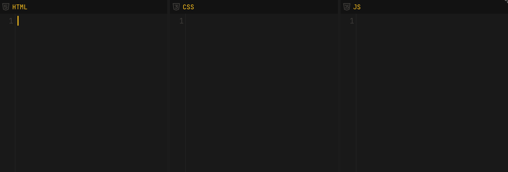

# `</VDB-Editor>`

> A browser-based code editor inspired by CodePen.

---

# `</About>`

VDB-Editor is a frontend playground where you can write HTML,CSS and JS side by side.

---

# `</Features>`

### Current Features

- Resizable editor windows
- Multiple editor layouts
- Hide/show panels
- Import `.html` files
  - Automatically extracts:
    - HTML
    - CSS
    - JavaScript
- Live preview system
- Local auto-saving (Auto saves locally)
- Syntax error highlighting.
- Theme switcher

---

### Planned Features

- Local image storage system
- Multi-page projects
- Theme maker

---

# `</Known-Bugs>`

### Navigation Bug

Clicking hyperlinks inside the preview and then using the browser back button can sometimes break the editor state.

---

# `</Future-Vision>`

One of my goals for this project is to create an education-focused version of the platform.

At my school, we currently use **Safe Exam Browser** together with a website where students can write code and upload their work to the teacher. In practice, the system we use feels outdated, inefficient, and is a pain in the ass to use.

I know this is probably not a universal problem different schools use different tools, and some may already have better solutions. But I still believe (hope) that I can maybe help some people with this.

My vision is to build a platform that is:

- Faster and easier to use
- More modern and intuitive for students
- Easy to customize for teachers.

It would be amazing to eventually see my own school use this project, and maybe even other schools in the future.

---

# `</Try-It>`

### Online Version

Try it here:  
https://tibedev.github.io/VDB-Editor/

---

### Run Locally

You can also download the whole project and simply open the index.html to get started.
